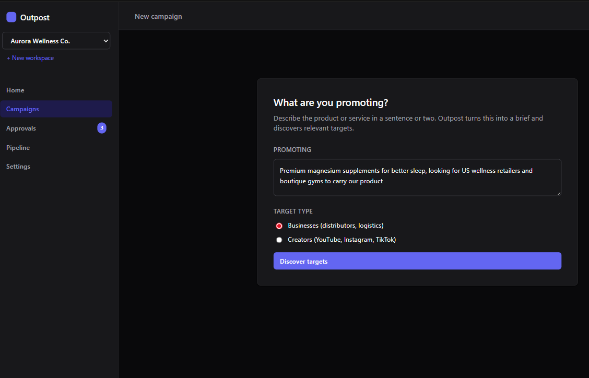
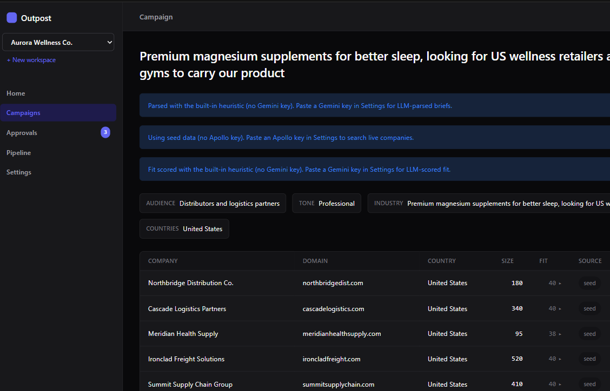
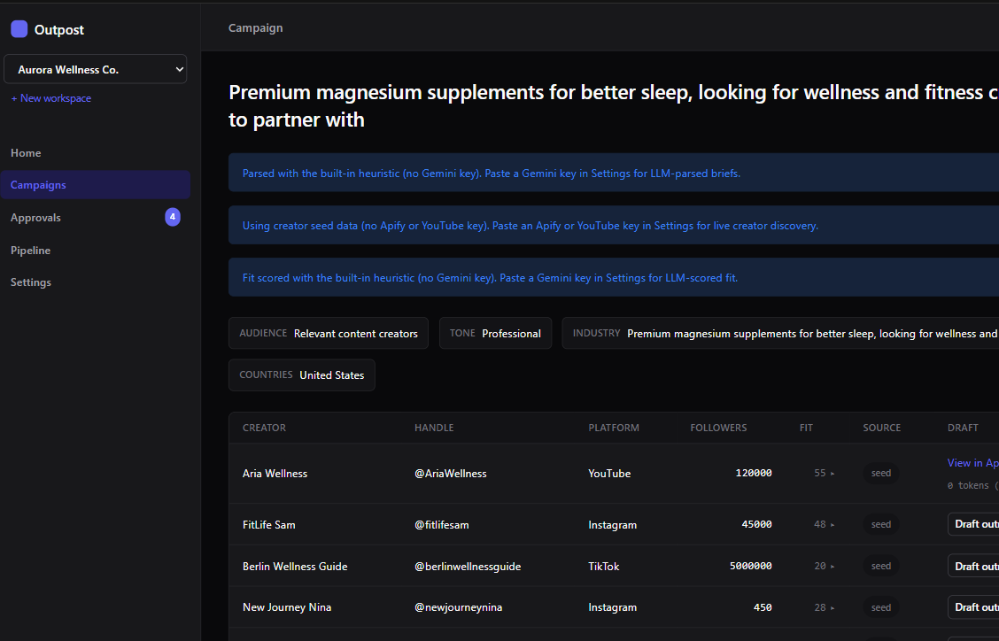
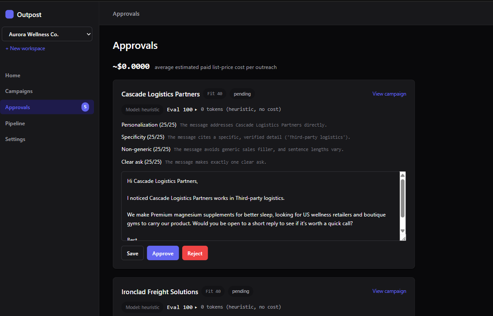
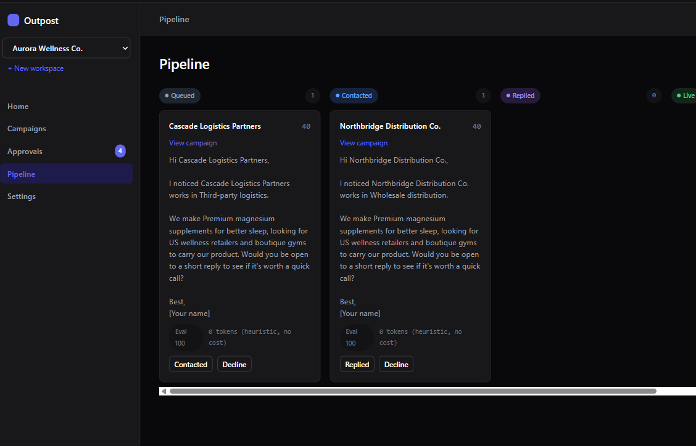
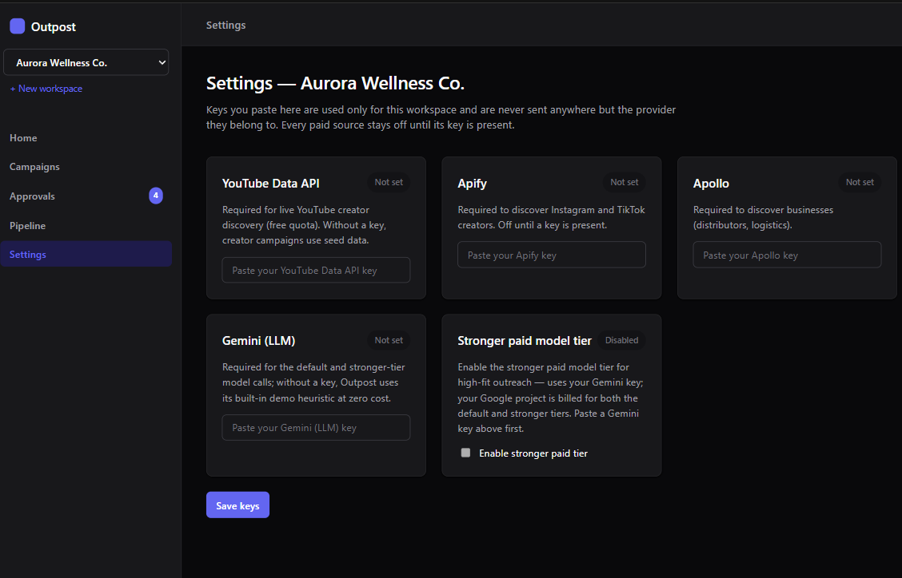

# Outpost

**A context-aware outreach workbench for founder-led brands.**

Outpost turns a plain-language product brief into a reviewable outreach pipeline. It finds relevant creators or business partners, scores each target against cited evidence, drafts personalized outreach, and keeps a human in control before anything moves forward.

The first use case came from a friend launching a consumer brand who needed to identify supply-chain partners, niche operators, and creators without building an expensive outbound stack. That concrete need became the product hypothesis behind Outpost: small teams should be able to reuse their business context across discovery and outreach instead of researching every target and rewriting every message from scratch.

> Outpost is a working prototype and portfolio build, not a claim of product-market fit. The initial problem came from one real founder workflow; broader demand and business impact still need validation.

## Product walkthrough

### 1. Start with the product, not a complex campaign form

The user describes what they are promoting and chooses whether to find businesses or creators. Outpost converts the input into a validated campaign brief.



### 2. Discover and rank business partners

For business campaigns, Outpost searches Apollo when a suitable key and plan are available. Every provider result is normalized into the same candidate and evidence model before fit is assessed.



### 3. Reuse the same engine for creator outreach

Creator campaigns use YouTube or Apify for discovery, but keep the same scoring, drafting, approval, audit, and pipeline workflow. Only the source-specific discovery layer changes.



### 4. Put every draft behind a human decision

Outpost drafts against verified target evidence and evaluates the result across personalization, specificity, non-genericness, and clarity of ask. The user can edit, approve, or reject every message.



### 5. Track the relationship without pretending the product sent anything

Approved drafts move through a lightweight pipeline: queued, contacted, replied, live, or declined. Outpost does not transmit messages; `contacted` is a user-recorded workflow state.



### 6. Bring your own providers—or evaluate the full loop with none

YouTube, Apify, Apollo, and Gemini credentials are configured per workspace. Seeded targets and deterministic heuristics preserve an end-to-end zero-key demo path.



## The product choices behind it

| Choice | What it solves |
|---|---|
| One engine for creators and businesses | The same workflow supports influencers, distributors, logistics partners, and other niche operators without duplicating the product. |
| Evidence before generation | Fit reasons and personalized messages must trace back to stored provider data, reducing plausible-sounding but fabricated output. |
| Human approval before any external action | Users retain control over factual accuracy, brand voice, and whether contact should happen. There is no send path in the codebase. |
| Bring-your-own keys with a zero-key path | Variable provider cost stays with the person generating it, while seeded data keeps setup and evaluation friction low. |
| Honest provider fallbacks | Missing credentials, invalid keys, insufficient plans, and provider failures are shown as distinct states; fallback data is never presented as live. |
| Cost-aware model routing | Stronger-model escalation is reserved for high-fit, low-confidence cases and remains disabled until an approved model has verified pricing. |
| Local-first implementation | A deliberately small stack kept the prototype fast to inspect, test, and change while the workflow was still being shaped. |

The detailed rationale, trade-offs, corrections, and revisit conditions are in [Product Decision Record 2.0](docs/DECISIONS-2.0.md).

## How the workflow holds together

1. **Intake** converts free text into a structured brief.
2. **Discovery** selects a licensed provider or the zero-key seed source.
3. **Normalization** converts provider-specific data into a shared evidence contract.
4. **Scoring** assigns fit from 0–100 and requires cited evidence for every reason.
5. **Drafting** can reference only evidence that passed the grounding check.
6. **Evaluation** scores the draft on four visible quality dimensions.
7. **Approval** lets a person edit, approve, or reject.
8. **Pipeline** records what happens after approval without implying automated sending.

Structured model output is validated twice: first for schema, then against normalized provider evidence. A well-formed citation that does not match the source data is rejected. When grounding fails, Outpost uses a plainer deterministic result rather than persist a more impressive but unsupported one.

## AI-assisted build process

I solo-built Outpost with AI coding agents, using the repository rather than a chat thread as the source of truth. `SPEC.md` defined the product boundary, `design.md` locked the interface system, `DECISIONS.md` preserved active constraints, and `PROGRESS.md` carried verified state between sessions.

The product shipped in gated vertical slices: local foundation and workspace separation, business discovery, evidence-backed scoring, drafting and approvals, creator sources, then evaluation and cost-aware routing. Each slice was planned before implementation, reviewed against explicit acceptance criteria, and added to a retained regression suite before the next slice began.

Implementation and review used different coding agents. That separation caught issues the implementing agent had normalized: an identical-request “retry,” overstated multi-tenancy language, a duplicate-spend race before persistence, and pricing validation that accepted non-finite values. When one slice began before plan approval, I preserved the work on a separate branch, reset to the last verified state, and reviewed each changed file before selectively reusing it.

The objective was not to maximize generated code. It was to use AI for implementation speed while keeping product scope, trade-offs, evidence, and release gates under human control.

## Architecture

```text
app/main.py          FastAPI routes and page orchestration
app/db.py            SQLite schema, migrations, workspace scoping, state, and audit
app/models.py        Pydantic contracts for briefs, candidates, scores, drafts, and evals
app/sources/         Apollo, Apify, YouTube, and seed providers behind one Source contract
app/agent/           Intake, scoring, drafting, evaluation, and routing logic
app/llm.py           Structured Gemini calls, validation, corrective retry, usage, and cost
app/templates/       Server-rendered interface
app/static/          Design tokens, application styles, and light/dark theme behavior
tests/               Retained unit and route-level regression suite
```

Python, FastAPI, SQLite, Jinja2, and minimal vanilla JavaScript keep the application local, inspectable, and easy to run. Provider-specific discovery stays at the boundary; the downstream campaign engine works against common candidate and evidence models.

## Run locally

Requirements: Python 3.11+.

```bash
git clone https://github.com/shantanu9841/Outpost.git
cd Outpost

python -m venv .venv
source .venv/bin/activate
pip install -r requirements.txt

uvicorn app.main:app --reload
```

On Windows PowerShell, activate the environment with:

```powershell
.venv\Scripts\Activate.ps1
```

Then open `http://127.0.0.1:8000`.

No API key is required to evaluate the end-to-end workflow. Create a workspace and start a creator or business campaign to use seeded targets plus deterministic scoring and drafting. Add workspace-scoped YouTube, Apify, Apollo, or Gemini keys in **Settings** to exercise live providers.

Run the retained test suite with:

```bash
python -m unittest discover -s tests
```

Current verified result: **292 tests passing**.

## Current status and scope

The complete intake-to-pipeline workflow is implemented. Creator and business campaigns share the same campaign, scoring, drafting, approval, audit, and pipeline engine.

Outpost is currently a local, single-owner prototype. Workspaces explicitly scope data, but there is no account system, authorization layer, production secret manager, shared-team permission model, hosted deployment, CRM sync, payment system, or automated sending. Those were deferred until the core product question is answered: does this workflow materially reduce the work required to reach the right people without lowering outreach quality?

Known verification gaps are documented in `PROGRESS.md`: live end-to-end creator discovery still needs suitable YouTube or Apify credentials; Apify's TikTok mapping is tested against a provider-shaped fixture but not confirmed against a live response; creator follower bands are demo heuristics; and the stronger paid model tier remains intentionally dormant until a model and its pricing are explicitly approved.

## What I would validate next

1. Observe 5–8 founder-led brands run one real campaign each.
2. Measure time from brief to first approved draft, plus approval, edit, and rejection rates.
3. Look for repeated use on a second campaign rather than treating first-run curiosity as adoption.
4. Review manually sent reply rates by target source and fit-score band.
5. Use rejection and rewrite reasons to choose the next investment: better discovery, collaborative review, CRM integration, or controlled sending.

## Repository guide

- [`SPEC.md`](SPEC.md) — product scope and build slices.
- [`DECISIONS.md`](DECISIONS.md) — detailed working memory and implementation constraints.
- [`docs/DECISIONS-2.0.md`](docs/DECISIONS-2.0.md) — reader-facing product decision record.
- [`PROGRESS.md`](PROGRESS.md) — current implementation state and verification history.
- [`design.md`](design.md) — interface principles, tokens, and components.
